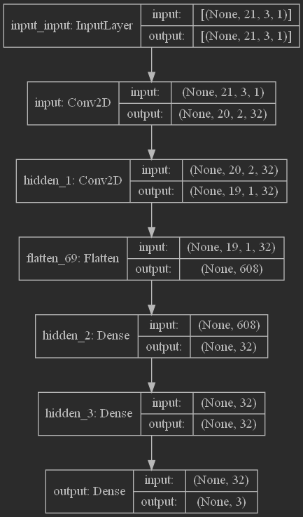
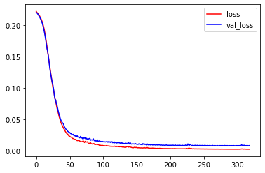
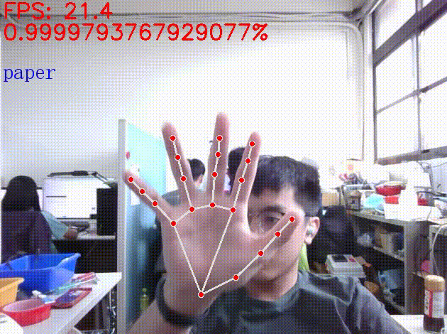

# MediaPipe-Gesture-Recognition

透過MediaPipe進行手部的標點，獲取(21, 3)大小的標點資料，並增加維度為(21, 3, 1)來使用Conv2D作為模型的設計，相比直接使用Conv1D和Dense更
少的params數量，另外由於訓練數少此方法也降低overfitting的結果。

# 模型設計

### Total params = 24931

# 訓練資料

訓練資料在 [dataset/markers](dataset/markers) ：

[paper](dataset/markers/paper), [scissors](dataset/markers/scissors), [Stone](dataset/markers/Stone) 三種資料各500筆

# 結果

