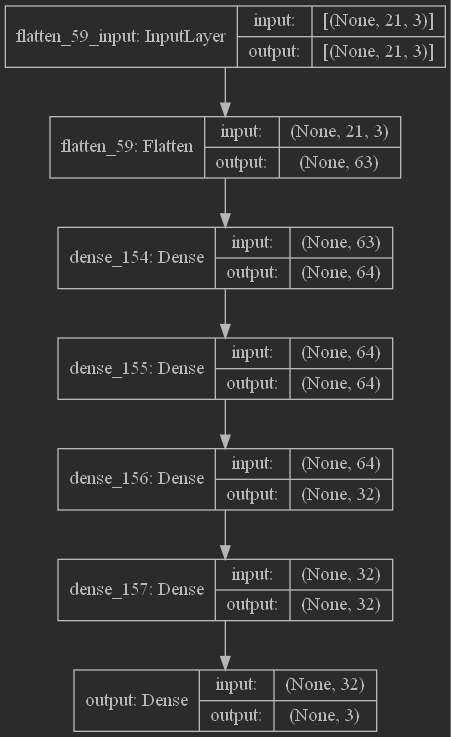

# MediaPipe-Gesture-Recognition

output_models\2022_05_01-20_14_08-dense_relu-params_11491-batch_512-optimizer_adam-loss_mse
```python
model = keras.Sequential([
    layers.Flatten(input_shape=(21, 3,)),
    layers.Dense(64, activation='tanh'),
    layers.Dense(64, activation='tanh'),
    layers.Dense(32, activation='tanh'),
    layers.Dense(32, activation='tanh'),
    layers.Dense(len(labels), activation='softmax', name='output')
])
optimizer = "adam"
loss = "mse"
batch_size = 512
```

```text
Model: "sequential_38"
_________________________________________________________________
Layer (type)                 Output Shape              Param #   
=================================================================
flatten_59 (Flatten)         (None, 63)                0         
_________________________________________________________________
dense_154 (Dense)            (None, 64)                4096      
_________________________________________________________________
dense_155 (Dense)            (None, 64)                4160      
_________________________________________________________________
dense_156 (Dense)            (None, 32)                2080      
_________________________________________________________________
dense_157 (Dense)            (None, 32)                1056      
_________________________________________________________________
output (Dense)               (None, 3)                 99        
=================================================================
Total params: 11,491
Trainable params: 11,491
Non-trainable params: 0
_________________________________________________________________
```
